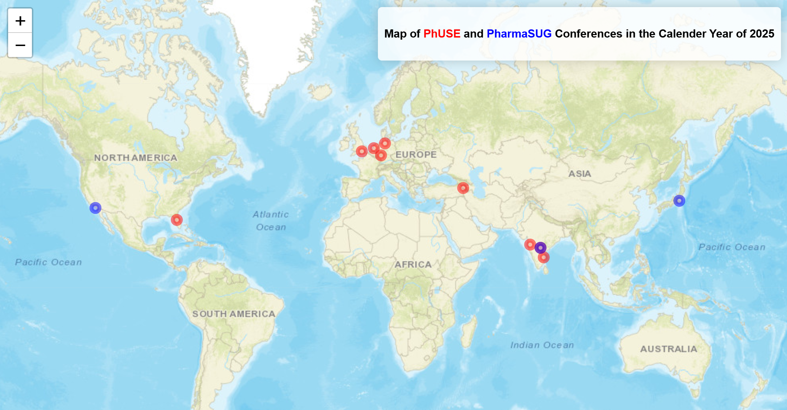
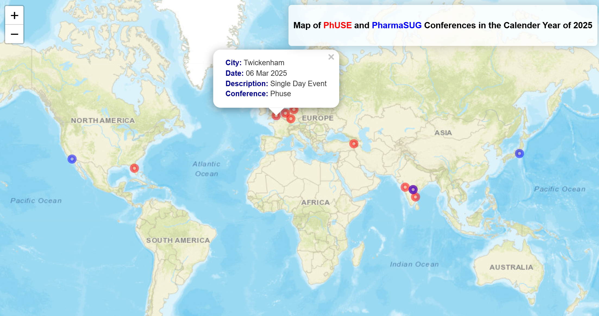

# PhUSE and PharmaSUG Conferences 2025 Map

This project showcases an interactive **Leaflet map** displaying the locations of **PhUSE** and **PharmaSUG** conferences scheduled for the year **2025**. The map is built using the **Leaflet package** and published via **GitHub Pages**.

## **Map Overview**
- **PhUSE Conferences:** Represented by **red circles**.  
- **PharmaSUG Conferences:** Represented by **blue circles**.

### **Features:**
- **Interactive Popups:**  
  Click on any circle to view details, including the **date**, **location**, and a **description** of the conference.
- **Zoom Functionality:**  
  Navigate and zoom in to explore specific locations closely.
- **Automated Updates:**  
  New events added to the 2025 calendar automatically update the map. This is managed via **GitHub Actions**, which runs the update script and refreshes the HTML page whenever data changes are pushed to the repository.

## **Live Demo:**  
Check out the live map here:  
[PhUSE and PharmaSUG 2025 Conference Map](https://jagadishkatam.github.io/phuse/phuse_map_2025.html)

##  **Technologies Used:**
- **R** with **Leaflet package**
- **GitHub Actions** for automation
- **GitHub Pages** for hosting